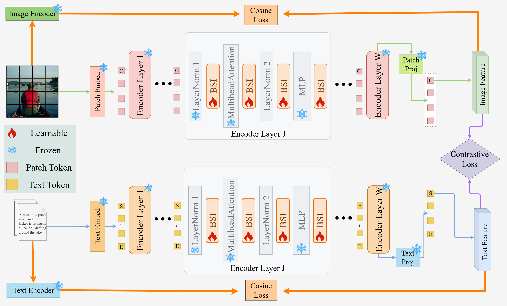

# BSI

**Beyond Structure Injection: Feature-Level Modulation for CLIP Adaptation in Cross-Modal Retrieval**

# Abstract

Adapting a large pre-trained vision-language model to cross-modal image-text retrieval (ITR) is currently dominated by one recipe: inject new structure into the frozen network, either by updating weights, inserting modules, or prepending learnable tokens. We revisit the assumption behind this recipe and ask whether adaptation must be structural at all. Our starting point is the observation that the quantity adaptation is meant to close, the modality gap between image and text features, is largely diagonal. Decomposing the gap into per-channel mean, per-channel variance, and cross-channel correlation components shows that the first two dominate the third by a factor of 6.39. We therefore introduce DeCAL (Decoupled Channel-Affine Learning) through Feature-Level Modulation, a novel paradigm that adapts a frozen backbone by re-calibrating the feature stream with a per-channel affine transform (i.e., 𝑥 → 𝑎 ⊙ 𝑥 + 𝑏), changing no pre-trained weights and introducing no cross-channel mixing. DeCAL applies four affine points inside every transformer block of both encoders, initializes them to identity, and keeps the visual and textual parameters decoupled. Decoupling seems to be a counter-intuitive operation, but it is not incidental: introducing cross-modal coupling operations will significantly interfere with the pre-trained independent modulation, and its performance is even lower than that of the zero-shot pre-trained model. 
We conduct extensive experiments on various ITR benchmarks including general natural scenes (MSCOCO and Flickr30K) and specialized remote sensing scenarios (UCM-Captions, RSICD and RSITMD). Experimental results verify that DeCAL requires only 0.25M trainable parameters on CLIP ViT-B/32 and 0.52M on CLIP ViT-L/14, below 0.2\% of the backbone, while achieving much higher performance than the state-of-the-art ITR methods.
More importantly, DeCAL consistently exhibits strong generalization capability across diverse cross-dataset and cross-domain scenarios. 

# Framework

<!-- To include the framework figure, place it under src/ and uncomment the next line.

-->

BSI keeps the CLIP dual encoder frozen and inserts four per-channel affine operators inside every
transformer block of both towers: before the attention and MLP sub-layers and after their outputs,
plus one operator on the visual class token. Each operator computes `x → a ⊙ x + b` with `a`
initialized to 1 and `b` to 0, so optimization starts exactly on the pre-trained function. The
visual and textual parameters are optimized independently, while the reference features of the
cosine penalty are produced by a frozen copy of CLIP. No pre-trained weight is modified and no
cross-channel mixing is introduced.

# Setup

Python >= 3.9

```bash
pip install torch torchvision
pip install -r requirements.txt
```

OpenAI CLIP is not distributed on PyPI and has to be installed from its repository:

```bash
pip install git+https://github.com/openai/CLIP.git
```

Additional dependencies: `pytorch-lightning`, `hydra-core`, `omegaconf`, `ftfy`, `regex`,
`einops`, `transformers`, `tqdm`.

# Training

BSI uses Hydra for configuration management. The main training entry point is `train.py`.

```bash
# Train on Flickr30K (default)
torchrun --nproc_per_node=4 train.py

# Train on MSCOCO
torchrun --nproc_per_node=4 train.py --config-name=train_mail_pure_coco

# Train on remote sensing datasets
torchrun --nproc_per_node=4 train.py --config-name=train_mail_pure_rsicd
torchrun --nproc_per_node=4 train.py --config-name=train_mail_pure_rsitmd
torchrun --nproc_per_node=4 train.py --config-name=train_mail_pure_ucm

# Switch backbone
torchrun --nproc_per_node=4 train.py model.original_clip_name=ViT-B/16
torchrun --nproc_per_node=4 train.py model.original_clip_name=ViT-L/14

# Change the seed
torchrun --nproc_per_node=4 train.py seed=123
```

Convenience wrappers that take the seed and the device list:

```bash
bash scripts/mail_pure/train_flickr30k.sh [seed] [gpu_devices]
bash scripts/mail_pure/train_coco.sh [seed] [gpu_devices]
bash scripts/mail_pure/train_rsicd.sh [seed] [gpu_devices]
```

The batch size is 128 for ViT-B/32 and ViT-B/16 and 32 for ViT-L/14, set per dataset in
`configs/dataset/*.yaml`.

Key switches in `configs/train_mail_pure_*.yaml`:

| Switch | Default | Description |
|--------|---------|-------------|
| `model.original_clip_name` | `ViT-B/32` | CLIP backbone |
| `model.mail_variant` | `independent` | modality coupling of the two towers (see Ablation) |
| `model.bridge_rank` | `1` | rank of the coupling bridge, `0` for a dense linear map |
| `model.use_all_gather` | `True` | contrastive loss over the globally gathered batch |
| `optimizer.lr` | `5e-4` | AdamW learning rate |
| `optimizer.weight_decay` | `0.01` | AdamW weight decay |
| `trainer.max_epochs` | `20` | cosine schedule decaying to `1e-6` |

# Ablation

The modality-axis ablation replaces the independent modulation of the two towers with a coupled
one and leaves every other component untouched. Each variant keeps the per-channel scale and
shift of **both** branches and adds a term generated from the other modality, so the independent
variant is the special case in which that term is absent.

```bash
# Coupled, low-rank (LoRA-style) bridge, parameter-matched at 0.25M
torchrun --nproc_per_node=4 train.py model.mail_variant=bridged model.bridge_rank=1

# Coupled, dense linear bridge (MaPLe style), 38.66M
torchrun --nproc_per_node=4 train.py model.mail_variant=bridged model.bridge_rank=0

# Reverse direction: textual parameters generated from the visual ones
torchrun --nproc_per_node=4 train.py model.mail_variant=bridged_rev model.bridge_rank=1

# One scale and one shift shared by both towers
torchrun --nproc_per_node=4 train.py model.mail_variant=shared_scalar
```

`model.bridge_alpha` sets the LoRA-style `alpha / rank` scaling of the low-rank bridge and
defaults to `alpha = rank`.

All variants are scheduled by one script:

```bash
VARIANTS="bridged:1 bridged:0" bash scripts/mail_pure/ablation_modality.sh [dataset] [seed] [gpu_devices]
```


# Data

The dataloaders read the paths declared in `configs/dataset/*.yaml`, so point them at your own
copy of the datasets before training. `configs/paths.py` lists the same layout and can serve as
a reference. The expected structure is:

```
flickr30k/
├── images/                    
└── annotations/
    ├── train.json    
    ├── val.json       
    └── test.json               

mscoco/
└── annotations/
    ├── train.json    
    └── coco_val.json

RSICD/          images/ + annocations/dataset_rsicd.json
RSIMTD/         images/ + dataset_RSITMD.json
UCM_captions/   imgs/   + dataset.json
```

MSCOCO training images come from `train2017` and evaluation images from `val2017` of the official
COCO release.

# Evaluation

The evaluation scripts are Hydra applications reading `configs/eval.yaml`; the checkpoint has to
be passed on the command line.

```bash
cd eval

# General-domain benchmarks
python eval_flickr2.py   checkpoint_path=/path/to/best.ckpt    # Flickr30K 1K test set
python eval_coco_new.py  checkpoint_path=/path/to/best.ckpt    # MSCOCO 5K test set

# Remote sensing benchmarks
python eval_RSICD.py     checkpoint_path=/path/to/best.ckpt
python eval_RSITMD.py    checkpoint_path=/path/to/best.ckpt
```

The backbone has to match `model.original_clip_name` in `configs/eval.yaml`:

```bash
python eval_flickr2.py checkpoint_path=/path/to/best.ckpt model.original_clip_name=ViT-L/14
```

Wrappers that resolve the paths for you:

```bash
bash scripts/mail_pure/eval_flickr30k.sh <checkpoint.ckpt> [gpu]
bash scripts/mail_pure/eval_coco.sh <checkpoint.ckpt> [gpu]
```

Two further scripts reproduce the quantitative analyses of the paper without any training:

```bash
cd eval
python gap_metric.py                                     # decomposition of the modality gap (Fig. 5)
python grad_metric.py --checkpoint /path/to/best.ckpt    # gradient norms of the modulation (Fig. 8)
```
